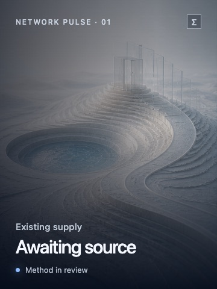
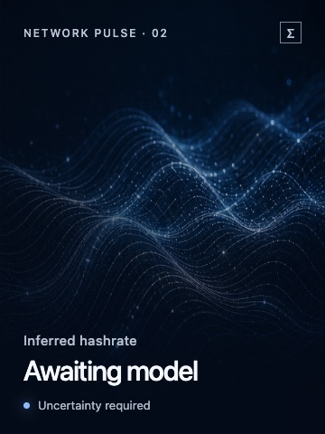
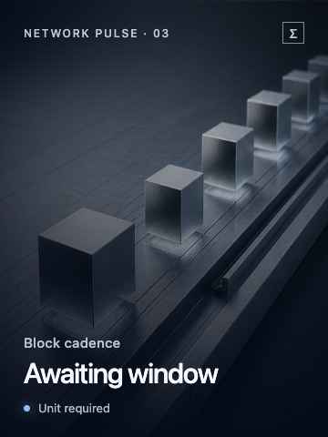
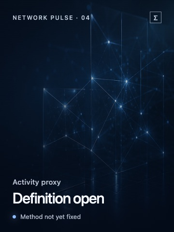
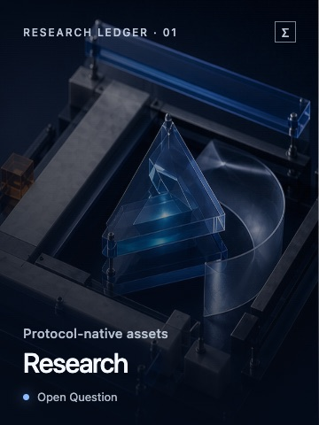
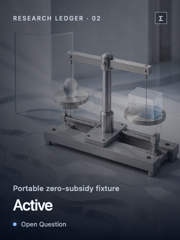
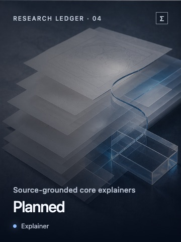
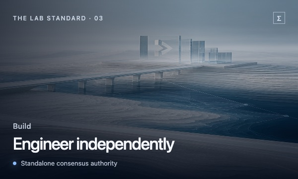

<!-- SPDX-License-Identifier: MIT -->

  <a href="discover/README.md">Discover</a>&nbsp;&nbsp;·&nbsp;&nbsp;
  <a href="insights/README.md">Insights</a>&nbsp;&nbsp;·&nbsp;&nbsp;
  <a href="network/README.md">Network</a>&nbsp;&nbsp;·&nbsp;&nbsp;
  <a href="node/README.md">Node</a>&nbsp;&nbsp;·&nbsp;&nbsp;
  <a href="docs/roadmap.md">Roadmap</a>

  

<h1 align="center">Ergon Lab</h1>

  <strong>Community research and engineering hub for Ergon.</strong> 
  One public place to discover the ideas, follow the network, read the research,
  and watch a standalone open-source node take shape.

  <a href="discover/README.md"><strong>Discover Ergon&nbsp;↗</strong></a>
  &nbsp;&nbsp;·&nbsp;&nbsp;
  <a href="insights/README.md"><strong>Read the field notes&nbsp;↗</strong></a>
  &nbsp;&nbsp;·&nbsp;&nbsp;
  <a href="node/README.md"><strong>Enter the workshop&nbsp;↗</strong></a>

---

> **Understand Ergon before touching the code—and inspect the evidence behind
> every claim.**

Ergon Lab is both a front door and a working desk: a public place for learning,
debate, observation, and independent engineering. Every page tells you whether
you are reading an explainer, hypothesis, simulation, observation, reproduced
result, or open question.

## Enter the Lab

<table>
  <tr>
    <td width="50%" valign="top">
      
      
01 · ORIENTATION

      <h3>Discover Ergon</h3>
      
Start with the forces Ergon is trying to align, then move from first principles to open questions.

      
<a href="discover/README.md"><strong>Open the field guide&nbsp;↗</strong></a>

    </td>
    <td width="50%" valign="top">
      
      
02 · EDITORIAL

      <h3>Insights &amp; Vision</h3>
      
Essays, explainers, research notes, counterarguments, and long-form ideas—clearly labeled.

      
<a href="insights/README.md"><strong>Browse ideas and arguments&nbsp;↗</strong></a>

    </td>
  </tr>
  <tr>
    <td width="50%" valign="top">
      
      
03 · OBSERVATION

      <h3>Network Observatory</h3>
      
Read the network through sourced signals, explicit methods, units, timestamps, and uncertainty.

      
<a href="network/README.md"><strong>Open the observatory&nbsp;↗</strong></a>

    </td>
    <td width="50%" valign="top">
      
      
04 · ENGINEERING

      <h3>Node Engineering</h3>
      
Follow the standalone node from build instructions to compatibility tests and portable evidence.

      
<a href="node/README.md"><strong>Enter the engineering log&nbsp;↗</strong></a>

    </td>
  </tr>
</table>

## Network Pulse

A quiet reading of the chain. No number appears before its source, method, unit,
timestamp, and uncertainty are ready to travel with it.

<table>
  <tr>
    <td width="25%"></td>
    <td width="25%"></td>
    <td width="25%"></td>
    <td width="25%"></td>
  </tr>
</table>

[Open the observatory contract&nbsp;↗](network/README.md)

## Now in the Lab

Research as it actually is: moving, bounded, and explicit about what remains
unknown. Delivery state and knowledge status always appear together.

<table>
  <tr>
    <td width="25%"></td>
    <td width="25%"></td>
    <td width="25%"></td>
    <td width="25%"></td>
  </tr>
</table>

[Open the visual roadmap&nbsp;↗](docs/roadmap.md) ·
[Inspect the canonical cockpit&nbsp;↗](cockpit/cockpit.yaml)

## Follow the node from its public root

The engineering story is deliberately sequential. The new implementation must
first prove that it can live honestly beside the legacy node on today's Ergon
mainnet. Only then does a separate testnet become the place to explore a future
fork.

**Verified public baseline** → **Legacy compatibility** → **Mainnet
coexistence** → **Optional observation** → **Experimental fork testnet** →
**Possible future mainnet decision**

The baseline is verified. Legacy compatibility is now active with one bounded
public regtest observation; it remains incomplete. Mainnet coexistence,
optional observation, testnet activation, and every future consensus decision
remain visibly blocked until their own evidence and limitations are public.

[See the complete node journey&nbsp;↗](node/README.md) ·
[Open the engineering ledger&nbsp;↗](docs/engineering/changes/README.md)

## A place to understand, question, and build

Three ways into the same public work: begin with the story, challenge the
argument, or inspect the implementation.

<table>
  <tr>
    <td width="33%"></td>
    <td width="33%"></td>
    <td width="33%"></td>
  </tr>
</table>

## Research horizon

The public research program progressively covers protocol-native assets,
proportional rewards, cyphercash, supply and emission, descriptive price
context, hashrate responsiveness and elasticity, difficulty adjustment, block
size and propagation, security, and fee markets.

Price material is historical context only. Ergon Lab does not publish financial
forecasts, investment recommendations, or implied future returns.

## For builders

| Entrance | What you will find |
| --- | --- |
| **[Node workshop&nbsp;↗](node/README.md)** | Build, run, test, and inspect the standalone node. |
| **[Build guide&nbsp;↗](doc/build-unix.md)** | Configure and compile on Unix; begin with the [installation overview](INSTALL.md). |
| **[Public roadmap&nbsp;↗](docs/roadmap.md)** | Follow delivery gates, knowledge status, and research boundaries. |
| **[Contributing guide&nbsp;↗](CONTRIBUTING.md)** | Propose reviewable, public-safe changes. |
| **[Security policy&nbsp;↗](SECURITY.md)** | Report vulnerabilities without exposing sensitive detail. |
| **[Publication policy&nbsp;↗](PUBLICATION_POLICY.md)** | Inspect provenance, licenses, reviewed changes, and proof ceilings. |

<strong>Public baseline and source-provenance boundary</strong>

This repository starts from the public Bitcoin Static v24.0.5 snapshot:

- source commit: `2e8d5f7635c899cc99e71f06dedbe72b3ff7f07b`
- source Git tree: `8a74bb952c2137156214b9fe5888c494bd77aeca`

Both identifiers are required. Changes after the snapshot are admitted only
through the reviewed public-source process in
[`PUBLICATION_POLICY.md`](PUBLICATION_POLICY.md). Private material, internal
history, operator data, secrets, endpoints, and unreviewed donor artifacts are
outside the publication boundary.

<strong>Standalone consensus boundary</strong>

The node is the authority for its own consensus validation, chain selection,
mempool policy, and persistent chain state. It must remain correct and usable
without an indexer.

Chronik, when present, is optional observe-and-index infrastructure. It may
derive and serve indexed views of node-accepted data. It must never decide or
override consensus validity, activation, chain selection, or mempool admission.
See the
[`consensus boundary`](docs/architecture/consensus-boundary.md).

## License

The public baseline is distributed under the MIT terms in [`COPYING`](COPYING).
New repository material must declare an SPDX-compatible license and preserve
all applicable upstream notices. Data and reproduction inputs may have separate
licenses recorded alongside their provenance.
